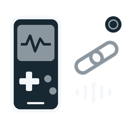

  
  <h1>AudioCast for TrimUI</h1>
  
<strong>Your Game Boy audio. On the Brick and on Push.</strong>

  
Stream GB and GBA game audio from a TrimUI Brick Hammer running StockUI to Ableton Link Audio over Wi-Fi, while keeping the Brick speaker playing.

  

    <a href="https://github.com/VolkerJunginger/AudioCast-TrimUI/releases/latest">Download the latest release</a> ·
    <a href="#installation">Install</a> ·
    <a href="docs/TROUBLESHOOTING.md">Troubleshooting</a>
  

  

## What it does

- Casts **Game Boy `.gb` and Game Boy Advance `.gba`** audio through the existing StockUI game menus.
- Sends **48 kHz stereo audio** to the Link Audio channel **Brick Out**.
- Keeps normal Brick speaker output.
- Toggles ON and OFF from one app, with a matching status icon.
- Runs from the **SD card**, with temporary audio configuration in `/tmp`.
- Creates **no AudioCast log files**.
- Restores the original GB/GBA launchers when switched OFF.

**Tested on a TrimUI Brick Hammer with StockUI and Push 3.** Game audio, restoration and the ON/OFF icon changes have been confirmed on the device. Other firmware, emulators and receiver combinations have not been validated.

## Installation

1. Download **`AudioCast-StockUI-v0.2.2-GB-GBA.zip`** from [Releases](https://github.com/VolkerJunginger/AudioCast-TrimUI/releases/latest). Choose the installer ZIP, not GitHub's source-code archive.
2. If upgrading, **quit your game and switch AudioCast OFF first**. Keep a backup of your SD card.
3. Extract the ZIP at the **SD-card root**, merging the `Apps` directory. The app should end up at `Apps/AudioCast/launch.sh`.
4. Safely eject the card and reboot the Brick.
5. Connect the Brick and Push to the same local Wi-Fi network. The tested setup uses the Push Wi-Fi network.
6. Open **Apps → AudioCast** once. It enables casting and returns to StockUI.
7. Start a GB or GBA game normally. On Push, select **Brick Out** from the Link Audio sources. The peer is **TrimUI Brick Hammer**.

The channel exists during a game session and is recreated for each game. You may need to select it again after changing games.

## ON and OFF

| ON | OFF |
|:--:|:---:|
|  |  |
| Casting enabled | Casting disabled |

Quit the game, then launch **AudioCast** again to switch it OFF and restore the original launchers. The icon represents **enabled/disabled**, not whether Push is connected. If StockUI shows an old icon, leave and reopen Apps or reboot.

**Always switch OFF before updating or deleting the app.** Replacing the app folder while it is ON can remove its activation records while leaving launcher wrappers behind. See [recovery instructions](docs/TROUBLESHOOTING.md#incomplete-upgrade-or-missing-activation-records) if this has happened.

## Scope and behavior

| Item | Behavior |
|---|---|
| Games | Existing GB/GBA RetroArch launchers; Gambatte, mGBA and gpSP variants matching StockUI's launcher format |
| Other systems and menu sounds | Outside this release's scope |
| Permanent changes | SD-card app files and reversible GB/GBA launcher wrappers |
| Firmware and global ALSA configuration | Unchanged |
| Game audio | Duplicated to the local speaker and Link Audio |
| Network failure | The relay keeps draining so a stalled sender does not block the speaker path |
| Audio setup failure | Falls back to the original launcher |
| Saves and core options | Stay in their normal locations |
| RetroArch configuration overrides | Automatic core/game overrides and save-on-exit are disabled only while casting; existing files are preserved |
| Logging | App output is discarded; RetroArch file logging is disabled during casting; old logs are left untouched |

## Help and development

- [Troubleshooting and recovery](docs/TROUBLESHOOTING.md)
- [Build instructions and architecture](docs/DEVELOPMENT.md)
- [Release history](CHANGELOG.md)
- [Report a problem](https://github.com/VolkerJunginger/AudioCast-TrimUI/issues/new/choose)

AudioCast uses [Ableton Link](https://github.com/Ableton/link) and the [tg5040 toolchain](https://github.com/loveretro/tg5040-toolchain). The app icons are original AudioCast artwork. This is an independent project, not an official Ableton or TrimUI product. See [third-party notices](THIRD_PARTY.md).

## License

[GPL-2.0-or-later](LICENSE), matching the open-source license used for Ableton Link. See [third-party notices](THIRD_PARTY.md) for dependency attribution.
