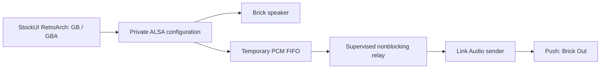

# Development

## Layout

- `Apps/AudioCast/`: the StockUI app and reversible game-launcher scripts.
- `src/sender.cpp`: 48 kHz stereo Link Audio sender.
- `src/session.cpp`: supervised FIFO relay and process cleanup.
- `src/checksum.cpp`: bundled POSIX-compatible checksum helper.
- `src/alsa_probe.cpp`: real ALSA capability/preflight probe.
- `tools/verify.py`: launcher, checksum, Linux audio/session and ZIP checks.
- `tools/make_icon.py`: original ON/OFF artwork, rendered with Pillow at build time.
- `.github/workflows/release.yml`: host verification, ARM64 build and release packaging.

## Audio path



Only the game process receives `ALSA_CONFIG_PATH`. The configuration and FIFO live under `/tmp`; the existing RetroArch binary is invoked with a temporary configuration copy. The relay drains the FIFO even if its sender stalls. Cleanup targets owned processes only.

The app wraps compatible `Emus/GB/launch*.sh` and `Emus/GBA/launch*.sh` files, preserving adjacent originals and a checksum manifest. It does not rewrite other systems, firmware or minarch. Internal `v0.2b` names remain for compatibility.

## Linux host verification

Install a C++17 compiler, CMake, Python 3, Git and ALSA development files. On Ubuntu:

```sh
sudo apt-get install build-essential cmake git python3 libasound2-dev python3-pil
git clone https://github.com/Ableton/link.git link
git -C link checkout 902aef95bf94af49746fdda5369b42cdcfa1e6d2
git -C link submodule update --init --recursive
cmake -S . -B host-build -DLINK_DIR="$PWD/link"
cmake --build host-build -j2
python3 tools/verify.py --build host-build
```

The ALSA integration test substitutes a null speaker for the physical codec; it exercises real ALSA plug/file routing, the FIFO, session supervision and sender. It does not prove Wi-Fi delivery or device sound. Hardware playback and icon switching were separately confirmed by the maintainer on a Brick Hammer and Push.

Launcher-only tests can run without compiling native tools:

```sh
python3 tools/verify.py
```

## ARM64 release

The GitHub workflow uses `ghcr.io/loveretro/tg5040-toolchain:latest` and the pinned Link commit above, including its submodules. The toolchain image tag is mutable, so builds are not claimed to be byte-for-byte reproducible.

Every build runs host checks before cross-compiling. Packaging verifies ZIP integrity, exact file contents, ARM64 executables, executable permissions, PNG dimensions and initial OFF artwork. Installers are StockUI ZIPs; the workflow never creates `.pak` files.

The release includes the installer, checksums and a source bundle containing the app and pinned Link/submodule sources. Build-time dependencies (compiler, CMake, Pillow and OS development packages) are not installed on the Brick.

Pushes to `main` and pull requests run verification. Publishing requires a manual workflow dispatch with **publish** selected, or the initial repository-import commit named `Publish AudioCast StockUI v0.2.2`. Published releases are never overwritten automatically. Update the release version and notes before publishing a subsequent version.

## Migration provenance

The initial dedicated-repository import comes from `VolkerJunginger/Testing-Github` commit `4142b969a368bae6014a2d21194067ebaf31d595` (StockUI v0.2.2). Production app scripts and native source are retained without behavioral edits. The migration changes source layout, documentation and packaging only.

The old repository retains historical NextUI experiments and earlier capability tests. Personal card snapshots, logs, ROMs and the one-card repair script are not part of this project.
